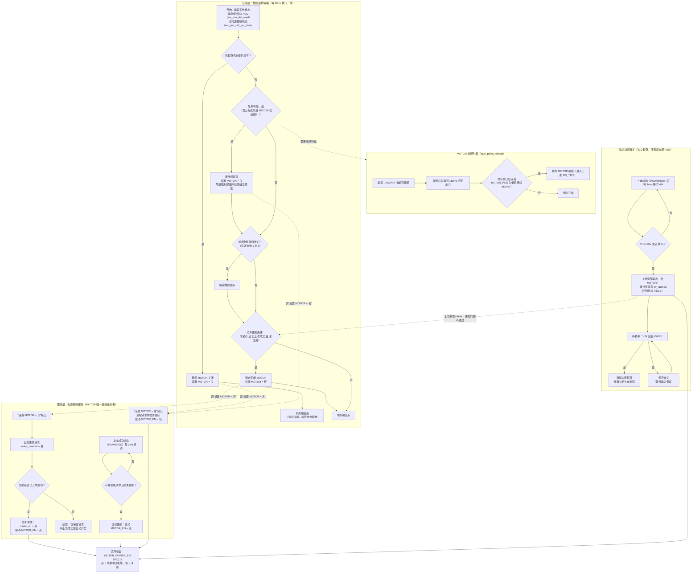

# MOTOR_EN 输出控制流程（E1_MASTER_POWER_CTU）

- **适用工程**：E1_MASTER_POWER_CTU（STM32F103RC 主电源板）
- **更新**：2026-09-21
- **说明**：描述 `MOTOR_POWER_EN`（PC11）从“上层策略判断”到“实际拉高/拉低”的完整程序流程，
  并包含同样会关断 MOTOR 的**输入过压保护**（独立锁存）。
  全文用中文名称描述功能，括号内为对应代码符号/接口，便于对照源码。

---

## 1. 角色分工（先看这个）

| 模块 | 名称 | 职责 |
|------|------|------|
| 应用层 | 故障保护策略（`app_fault_policy_step`） | 每 10ms 判断：急停是否按下、MOTOR 是否故障、是否允许使能；调用“设置 MOTOR”接口 |
| 服务层 | 电源控制服务（`srv_pwr_ctrl`） | 直接驱动 MOTOR_EN 引脚；对“使能请求”做延后处理（必须已上电成功） |
| 驱动层 | 电源轨驱动（`drv_power`） | 把 `DRV_POWER_RAIL_MOTOR` 写到 PC11 引脚 |
| 状态来源 | 电源状态监测（`srv_pwr_det_read`）+ 电源控制状态（`srv_pwr_ctrl_get_state`） | 提供：有效急停、MOTOR_PGD、上电完成、各轨使能标志 |

关键约束：
- **急停/故障只关 MOTOR**，VIN_DC-DC / 24V / AUX 三路不受急停影响；
- MOTOR **必须在上电流程成功（POWERED）后**才允许使能；未上电时的使能请求只记录、不动作；
- MOTOR 故障判据带 **使能稳定窗口 150ms + 掉电去抖 50ms**，避免使能瞬间误关断；
- **输入过压保护（独立于 MOTOR 锁存）同样会关断 MOTOR**：已上电后 VIN ≥60V 持续 5s → 关断全部输出（含 MOTOR）并锁存，输入回落 ≤58V 后自动清除并重新上电；过压期间**急停释放无效**（只能靠输入恢复）。
- 低压（VIN <36V）在已上电后**不关断**输出，仅监测。

---

## 2. 程序流程图

> 已导出静态矢量图：[`MOTOR_EN输出控制流程.svg`](./MOTOR_EN输出控制流程.svg)（与本文件同目录，可直接插入文档/PPT）。

---

## 3. 流程文字说明（按执行顺序）

1. **周期开始**：读取系统状态（有效急停 `estop_on`、MOTOR 电源正常 `motor_power_ok`）与电源控制状态快照（是否已上电成功 `powered_on`、MOTOR 是否已使能 `motor_en`）。
2. **已锁存且急停仍按下**：保持 MOTOR 关闭（若有异常打开也强制关闭），本周期直接结束。
3. **触发判断**（满足任一即触发）：
   - 有效急停 `estop_on` 为真；
   - 或：已上电成功且 MOTOR 故障判据成立（见第 4 点）。
   触发后：置锁存、**立即关闭 MOTOR**、风扇满速、记录原因。
4. **MOTOR 故障判据**：仅当 MOTOR 已使能时生效；使能后先给 150ms 稳定窗口，窗口之后 MOTOR_PGD 持续为低 ≥50ms 才判为故障（防使能瞬间软启动未就绪误判）。
5. **急停释放沿**：检测到“有效急停 1→0”时解除锁存。
6. **允许使能判断**：`未锁存 且 已上电成功 且 未急停` 三者同时满足 → 请求使能 MOTOR；否则保持原状。
7. **服务层使能处理**：
   - 已上电成功 → 立即拉高 MOTOR_EN；
   - 未上电成功 → 仅记录请求（延后），由“上电成功状态”每 1ms 检查并自动补使能；
   - 关闭请求 → 任何时候立即拉低，并清除延后请求。
8. **最终输出**：`MOTOR_POWER_EN`（PC11），高=电机电源使能，低=关断。
9. **输入过压保护（独立于上述锁存，但同样影响 MOTOR_EN）**：
   - 已上电成功状态下持续监测 VIN：≥60V 累计满 5s → **关断全部输出（含 MOTOR）**、置过压锁存、回待机；
   - 待机中 VIN 回落 ≤58V → 自动清除锁存并重新执行上电流程；
   - 过压锁存期间 `powered_on=false`，第 6 步“允许使能判断”不会通过，因此**急停释放也无法让 MOTOR 恢复**，只能等输入电压回到允许范围。
   - 已上电后 VIN <36V（低压）不关断输出，仅监测。

---

## 4. 触发表（便于查代码）

| 条件 | 代码位置 | 动作 |
|------|----------|------|
| 已锁存 且 急停按下 | `app_fault_policy_step` 起始分支 | 确保 MOTOR 关闭 |
| 有效急停 | `st.estop_on` | 锁存 + 关 MOTOR + 风扇满速 |
| MOTOR 使能后 PGD 丢失（150ms 稳定 + 50ms 去抖） | `fault_policy_critical` | 锁存 + 关 MOTOR |
| 急停释放沿 | `utils_edge_detect(...) == UTILS_EDGE_FALLING` | 解除锁存 |
| 未锁存 && 已上电 && 未急停 | `motor_want` | 请求使能 MOTOR |
| 未上电时的使能请求 | `srv_pwr_ctrl_motor_set(true)` | 延后记录，POWERED 后自动开启 |
| 任何关闭请求 | `srv_pwr_ctrl_motor_set(false)` | 立即关闭并清除延后请求 |
| **已上电后 VIN ≥60V 持续 5s（过压保护）** | `pwr_state_powered` → `pwr_rails_all_off()` + `ov_latched` | 关断全部输出（含 MOTOR）回待机；VIN ≤58V 自动清锁存重新上电 |
| 已上电后 VIN <36V | 无动作（仅监测） | 不关断输出 |
