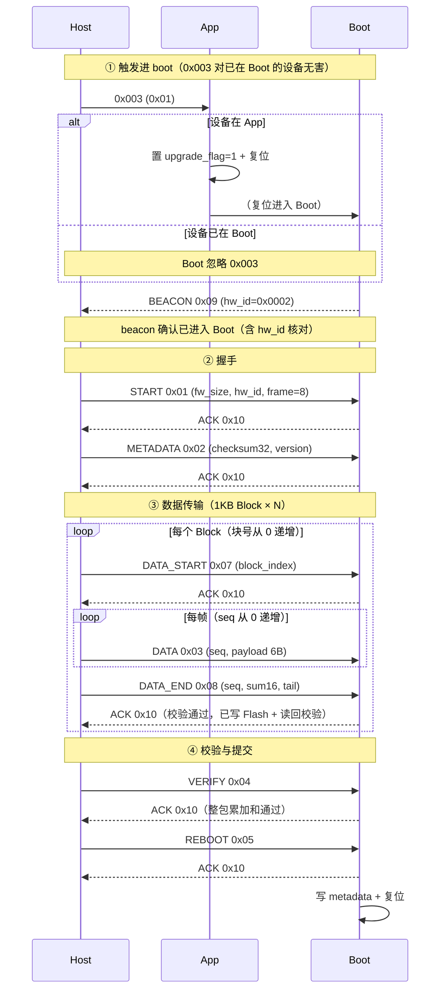

# E1_Master_Power_Manage 升级协议规范

> 版本 v2.0 · 自 `stm32_g474_boot` 移植并扩展（经典 CAN 8 字节 + Boot 心跳 beacon + A/B 运行槽提升）。
> 机制与操作见 [boot_upgrade.md](boot_upgrade.md)，迁移记录见 [boot_migration.md](boot_migration.md)。
> 帧 ID 总览（含 `0x001/0x002/0x200-0x202`）见 [protocol_master.md](protocol_master.md)。

---

## 1. 系统架构

**一句话概述**：E1 主控电源板通过 CAN 1 Mbps 经典总线，由 Boot 镜像接收新固件写入对侧 A/B 分区，整包校验通过后提交并复位，Boot 将活动分区提升到 App 链接基址后启动新版本。

**通用设计原则**：

| 原则 | 内容 |
|------|------|
| 传输介质 | CAN 经典帧，标准 11-bit ID，`DLC ≤ 8`，波特率 `1_000_000` bps |
| 主从模型 | 上位机为 Host（`0x701`），主电源板为 Node（`0x702`）；App 态另有 `0x003` 触发帧 |
| 帧长协商 | `max_frame_size` 在 START 帧协商，本协议**仅支持 `8`**（bxCAN 经典 CAN） |
| 固件原子性 | 每 `1KB` Block 独立校验（16-bit 累加和）+ 整包 32-bit 累加和，双保险 |
| 分区安全 | 双 A/B 分区；升级写入**对侧**，已提交分区不动；失败/取消自动回滚 |
| 运行槽约束 | App 固定链接于 `0x08020000`（A），Boot 启动时把活动分区**提升（拷贝）到 A** 再运行 |
| 状态可观测 | Boot 在 IDLE 态周期发送 beacon（`0x09`），Host 据此自动判断是否需要 `0x003` 触发 |

---

## 2. 布局 / 寻址空间

### 2.1 Flash 分区表（STM32F407，1 MB）

| 区域 | 起始地址 | 大小 | 扇区 | 用途 / 管理者 |
|------|----------|------|------|----------------|
| BOOT | `0x08000000` | 128 KB | S0-S4 | Boot 镜像（启动决策 + 升级接收） |
| App A | `0x08020000` | 128 KB | S5 | App 链接基址（**唯一运行槽**） |
| App B | `0x08040000` | 128 KB | S6 | 暂存槽（新固件写入处） |
| Metadata | `0x08060000` | 256 KB | S7-S8 | `boot_metadata_t`，`boot_flash`/`srv_boot_ctrl` 共享 |
| APP 参数 | `0x080A0000` | 256 KB | S9-S10 | `srv_param_store` |
| 空闲 | `0x080E0000` | 128 KB | S11 | 预留 |

### 2.2 核心结构体 `boot_metadata_t`（24 B，ring_storage KV `"meta"`）

| 字段 | 偏移 | 长度 | 类型 | 说明 |
|------|------|------|------|------|
| `magic` | 0 | 4 | `uint32_t` | 固定 `0x424F4F54`（"BOOT"） |
| `boot_partition` | 4 | 1 | `uint8_t` | `0`=A，`1`=B（当前已提交分区） |
| `upgrade_flag` | 5 | 1 | `uint8_t` | `0`=正常，`1`=升级中（0x003 触发置位） |
| `version` | 6 | 2 | `uint16_t` | 固件版本号 |
| `fw_size` | 8 | 4 | `uint32_t` | 固件有效字节数 |
| `fw_checksum` | 12 | 4 | `uint32_t` | 整包 32-bit 累加和 |
| `reboot_counts` | 16 | 4 | `uint32_t` | 上电启动计数（Boot/App 各 +1） |
| `reserved` | 20 | 4 | `uint32_t` | 预留（须为 `0`） |

> 字节契约与 `stm32_g474_boot/service/boot/boot_flash.h` 逐字节一致，**不得增删字段**。

---

## 3. 通信链路层

### 3.1 标识符分配

| CAN ID | 方向 | 用途 |
|--------|------|------|
| `0x701` | Host → Node | 升级协议帧（START/METADATA/DATA/…/REBOOT/CANCEL） |
| `0x702` | Node → Host | 应答 ACK/NACK + Boot 心跳 BEACON |
| `0x003` | Host → Board | App 态进 boot 触发帧（`DLC ≥ 1`，`data[0] = 0x01`） |

### 3.2 帧协商

- `max_frame_size` 在 START 帧第 7 字节协商；本协议仅接受 `8`（经典 CAN），其余值回 NACK `BOOT_STATUS_FRAME_SIZE`。
- 单帧数据载荷 = `max_frame_size - 2` = `6` 字节。

### 3.3 通用帧格式

除 START/METADATA/BEACON 外，所有帧遵循：

| Byte 0 | Byte 1 | Byte 2.. |
|--------|--------|----------|
| `cmd`（命令字） | `seq`（序号） | 载荷字段 |

| 字段 | 偏移 | 长度 | 说明 |
|------|------|------|------|
| `cmd` | Byte 0 | 1 | `uint8_t`，命令字，见 §4.1 |
| `seq` | Byte 1 | 1 | `uint8_t`，包序号（块内从 `0` 递增） |

---

## 4. 协议帧定义

### 4.1 命令字一览表

| 宏 | 值 | 方向 | 用途 |
|----|----|------|------|
| `BOOT_CMD_START` | `0x01` | H→N | 开始升级（协商） |
| `BOOT_CMD_METADATA` | `0x02` | H→N | 元数据（整包校验和 + 版本） |
| `BOOT_CMD_DATA` | `0x03` | H→N | 数据帧 |
| `BOOT_CMD_VERIFY` | `0x04` | H→N | 请求整包校验 |
| `BOOT_CMD_REBOOT` | `0x05` | H→N | 提交并复位 |
| `BOOT_CMD_CANCEL` | `0x06` | H→N | 取消，安全退回 IDLE |
| `BOOT_CMD_DATA_START` | `0x07` | H→N | 块传输启动（携带块号） |
| `BOOT_CMD_DATA_END` | `0x08` | H→N | 块尾（16-bit 校验和 + 尾数据） |
| `BOOT_CMD_BEACON` | `0x09` | N→H | Boot 心跳（E1 扩展） |
| `BOOT_CMD_ACK` | `0x10` | N→H | 肯定应答 |
| `BOOT_CMD_NACK` | `0x11` | N→H | 否定应答（携带错误码） |

### 4.2 逐帧解析

#### START `0x01`（8 字节，无 seq）

| 偏移 | Byte 0 | Byte 1 | Byte 2 | Byte 3 |
|------|--------|--------|--------|--------|
| +0 | `0x01` | `fw_size[31:24]` | `fw_size[23:16]` | `fw_size[15:8]` |
| +4 | `fw_size[7:0]` | `hw_id[15:8]` | `hw_id[7:0]` | `max_frame_size` |

| 字段 | 偏移 | 长度 | 说明 |
|------|------|------|------|
| `fw_size` | Byte 1-4 | 4 | `uint32_t` 大端，固件总字节数，须 `> 0` 且 `≤ 131072` |
| `hw_id` | Byte 5-6 | 2 | `uint16_t` 大端，硬件兼容 ID，须 `= 0x0002`，否则回 NACK `BOOT_STATUS_HW_MISMATCH` |
| `max_frame_size` | Byte 7 | 1 | `uint8_t`，仅支持 `8`，否则回 NACK `BOOT_STATUS_FRAME_SIZE` |

#### METADATA `0x02`（7 字节，无 seq，Host 补齐到 8）

| 偏移 | Byte 0 | Byte 1 | Byte 2 | Byte 3 |
|------|--------|--------|--------|--------|
| +0 | `0x02` | `checksum[31:24]` | `checksum[23:16]` | `checksum[15:8]` |
| +4 | `checksum[7:0]` | `version[15:8]` | `version[7:0]` | — |

| 字段 | 偏移 | 长度 | 说明 |
|------|------|------|------|
| `checksum` | Byte 1-4 | 4 | `uint32_t` 大端，整包 32-bit 累加和（VERIFY 阶段比对） |
| `version` | Byte 5-6 | 2 | `uint16_t` 大端，固件版本号 |

#### DATA `0x03`（2 + 载荷 6 字节）

| 偏移 | Byte 0 | Byte 1 | Byte 2..7 |
|------|--------|--------|-----------|
| +0 | `0x03` | `seq` | `payload[6]` |

| 字段 | 偏移 | 长度 | 说明 |
|------|------|------|------|
| `seq` | Byte 1 | 1 | `uint8_t`，块内帧序号，从 `0` 递增；错序即时回 NACK `BOOT_STATUS_INVALID_FRAME` |
| `payload` | Byte 2-7 | 6 | 数据载荷，按序累积进 1KB 块缓冲 |

#### DATA_START `0x07`（≥4 字节，Host 补齐到 8）

| 偏移 | Byte 0 | Byte 1 | Byte 2 | Byte 3 |
|------|--------|--------|--------|--------|
| +0 | `0x07` | 保留（`0x00`） | `block_index[15:8]` | `block_index[7:0]` |

| 字段 | 偏移 | 长度 | 说明 |
|------|------|------|------|
| `block_index` | Byte 2-3 | 2 | `uint16_t` 大端，块号；与期望块号不符回 NACK `BOOT_STATUS_BLOCK_INDEX_MISMATCH` 并回带期望块号 |

#### DATA_END `0x08`（4 + 尾数据 ≤8 字节）

| 偏移 | Byte 0 | Byte 1 | Byte 2 | Byte 3 |
|------|--------|--------|--------|--------|
| +0 | `0x08` | `seq` | `sum16[15:8]` | `sum16[7:0]` |
| +4 | `remaining[4]`（可少于 4） | | | |

| 字段 | 偏移 | 长度 | 说明 |
|------|------|------|------|
| `seq` | Byte 1 | 1 | `uint8_t`，本块最后一帧序号 |
| `sum16` | Byte 2-3 | 2 | `uint16_t` 大端，**全 1024 字节**（不足补 `0x00`）累加和 `& 0xFFFF` |
| `remaining` | Byte 4+ | ≤4 | 本块剩余尾数据；与累积数据合计满 1KB 后校验 |

#### VERIFY / REBOOT / CANCEL `0x04/0x05/0x06`（2 字节）

| 偏移 | Byte 0 | Byte 1 |
|------|--------|--------|
| +0 | `0x04/0x05/0x06` | 保留（`0x00`） |

| 命令 | 行为 |
|------|------|
| `0x04` VERIFY | 计算目标分区整包 32-bit 累加和，与 METADATA 的 `checksum` 比对；不匹配回 NACK `BOOT_STATUS_CHECKSUM_ERR` |
| `0x05` REBOOT | 写 metadata（新分区、`upgrade_flag=0`）→ ACK → 复位；ACK 须先真正上总线再复位 |
| `0x06` CANCEL | 任意状态安全退回 IDLE，回 ACK |

#### BEACON `0x09`（8 字节，N→H）

| 偏移 | Byte 0 | Byte 1 | Byte 2 |
|------|--------|--------|--------|
| +0 | `0x09` | `hw_id[15:8]` | `hw_id[7:0]` |

| 字段 | 偏移 | 长度 | 说明 |
|------|------|------|------|
| `hw_id` | Byte 1-2 | 2 | `uint16_t` 大端，Boot 硬件兼容 ID `= 0x0002`；Host 据此核对目标板并判断设备已在 Boot |

#### ACK / NACK `0x10 / 0x11`（8 字节，N→H）

| 偏移 | Byte 0 | Byte 1 | Byte 2 | Byte 3-4 |
|------|--------|--------|--------|----------|
| +0 | `0x10/0x11` | `cmd`（应答对象） | `status/error_code` | `block_index`（仅 `*_idx` 变体） |

| 字段 | 偏移 | 长度 | 说明 |
|------|------|------|------|
| `cmd` | Byte 1 | 1 | `uint8_t`，被应答/否决的命令字 |
| `status/error_code` | Byte 2 | 1 | ACK 为 `BOOT_STATUS_OK`；NACK 为错误码（见 §6.3） |
| `block_index` | Byte 3-4 | 2 | `uint16_t` 大端，DATA_START/NACK 重同步时回带期望块号 |

---

## 5. 升级 / 业务流交互

### 5.1 主流程时序

### 5.2 边界与断点续传设计

| 场景 | 机制 |
|------|------|
| 块号不匹配 | 板端回 NACK `BOOT_STATUS_BLOCK_INDEX_MISMATCH` 并在 Byte 3-4 回带**期望块号**；Host 跳转寻址重发 |
| 块内错序 | DATA 序号与期望不符即时 NACK `BOOT_STATUS_INVALID_FRAME`；块局部复位，等待 Host 重发 DATA_START |
| Block 累加和失败 | 回 NACK `BOOT_STATUS_BLOCK_CHECKSUM`；Host 重发同块（最多 3 次） |
| 块内帧间隔超时 | 板端 NACK `BOOT_STATUS_TIMEOUT` 回带期望块号；块局部复位 |
| 会话中途无响应 | Host 以 6s 挂钟判定失联并中止；板端 6s 全局超时自动回 IDLE |
| 升级失败 / 取消 | 板端回 IDLE 后经回滚延时（默认 `2000ms`）无新会话 → 清 `upgrade_flag` + 复位 → 跳回上个已提交版本 |

---

## 6. 超时与错误处理

### 6.1 超时参数表

| 参数 | 值 | 触发条件 | 行为与恢复策略 |
|------|----|----------|----------------|
| 全局会话超时 | `6000ms` | 非 IDLE 态无任何活动帧 | 复位到 IDLE，等待新会话 |
| 块级帧间隔超时 | `2000ms` | DATA_TRANSFER 块活跃期帧间隔超时 | NACK `BOOT_STATUS_TIMEOUT` + 回带期望块号，块局部复位。放宽以容忍主机 USB 逐帧节奏与偶发卡顿（死机主机仍由全局 6s 超时兜底） |
| 块 ACK 等待 | `3000ms` | Host 等待 DATA_END ACK | 超时重发 DATA_START 重同步 |
| 握手等待 | `5000ms` | Host 等待 START/METADATA/VERIFY/REBOOT ACK | 超时报错中止 |
| 触发后等待 beacon | `1000ms` | 发 `0x003` 后等待复位进 Boot + 首帧 beacon | 超时报「未检测到 Boot 心跳」 |
| 节点失联判定 | `6000ms` | Host 连续无节点响应 | 直接中止升级 |
| 块重试上限 | `3` 次 | Block 校验失败 | 超限中止 |
| 回滚延时 | `2000ms` | 会话结束回 IDLE 后无新会话 | 清 `upgrade_flag` + 复位，跳回上个版本 |
| REBOOT ACK 发送等待 | 有界轮询 ≤`50ms` | 发 REBOOT ACK 后 | 等 TX 邮箱空闲再复位，避免 ACK 被打断 |
| beacon 周期 | `100ms` | Boot 处于 IDLE | 周期发送 `0x09` |

### 6.2 状态转移矩阵

| 从 \ 到 | IDLE | START | DATA_TRANSFER | VERIFY_PENDING | REBOOT_PENDING |
|---------|:---:|:---:|:---:|:---:|:---:|
| **IDLE** | — | 收到合法 START | | | |
| **START** | CANCEL / 超时 / 致命错误 | 重复 START（重新协商） | 收到 METADATA | | |
| **DATA_TRANSFER** | CANCEL / 超时 / Flash 写读错 | | 数据收发中 / 块重同步 | 全部数据接收完毕 | |
| **VERIFY_PENDING** | 校验和失败 / CANCEL / 超时 | | | 重复 VERIFY | 整包累加和通过 |
| **REBOOT_PENDING** | CANCEL / 超时 | | | | 收到 REBOOT → 写 metadata + ACK + 复位 |

### 6.3 错误码表（`status/error_code`）

| 宏 | 值 | 触发条件 | 恢复策略 |
|----|----|----------|----------|
| `BOOT_STATUS_OK` | `0x00` | 成功 | — |
| `BOOT_STATUS_BLOCK_CHECKSUM` | `0x01` | 块 16-bit 累加和不匹配 | Host 重发同块（≤3 次） |
| `BOOT_STATUS_FLASH_WRITE_ERR` | `0x02` | Flash 写入失败 | 退回 IDLE，中止 |
| `BOOT_STATUS_FLASH_VERIFY_ERR` | `0x03` | Flash 读回校验失败 | 退回 IDLE，中止 |
| `BOOT_STATUS_CHECKSUM_ERR` | `0x04` | 整包 32-bit 累加和不匹配 | 退回 IDLE，中止 |
| `BOOT_STATUS_INVALID_FRAME` | `0x05` | 帧格式无效 / 序号错乱 | 块局部复位，等待 DATA_START |
| `BOOT_STATUS_INVALID_STATE` | `0x06` | 当前状态不允许该命令 | 忽略 / 回 IDLE |
| `BOOT_STATUS_TIMEOUT` | `0x07` | 块级或全局超时 | 块级重同步；全局回 IDLE |
| `BOOT_STATUS_HW_MISMATCH` | `0x08` | `hw_id != 0x0002` | 拒绝，检查 Host 配置 |
| `BOOT_STATUS_FLASH_ERASE_ERR` | `0x09` | 分区擦除失败 | 退回 IDLE，中止 |
| `BOOT_STATUS_FLASH_READ_ERR` | `0x0A` | Flash 读取失败（算校验和时） | 退回 IDLE，中止 |
| `BOOT_STATUS_FRAME_SIZE` | `0x0B` | `max_frame_size != 8` | 拒绝，Host 改用 8 字节 |
| `BOOT_STATUS_FW_TOO_BIG` | `0x0C` | `fw_size > 131072` | 拒绝，压缩固件或扩容分区 |
| `BOOT_STATUS_BLOCK_INDEX_MISMATCH` | `0x0D` | 块号不符（回带期望块号） | Host 跳转寻址重发 |

---

## 7. 启动 / 初始化决策

### 7.1 Boot 启动决策（`boot_task_try_boot_app`，上电即判）

| 条件（按序） | 判定结果 |
|--------------|----------|
| `magic != 0x424F4F54` | 进入 Boot 模式（等待升级） |
| `upgrade_flag != 0` | 进入 Boot 模式（0x003 已触发） |
| `fw_size == 0` | 进入 Boot 模式（无已烧写 App） |
| 分区 32-bit 累加和 `!= fw_checksum` | 进入 Boot 模式（校验失败） |
| 向量表非法（`SP` 越界 / `PC` 不在 A 分区） | 进入 Boot 模式 |
| **全通过** | 活动分区为 B 时先 `promote_to_a(B→A)` 再跳转 A 分区运行 |

### 7.2 App 进 boot 触发（`can_task` 接收 `0x003`）

| 条件 | 行为 |
|------|------|
| 收到 `0x003` 且 `DLC ≥ 1` 且 `data[0] = 0x01` | ISR 置标志 → 主循环调 `srv_boot_ctrl_request_boot()` → 置 `upgrade_flag=1` + 复位 |
| 其余帧 | 忽略或按 `0x001/0x002/0x200-0x202` 分发 |

### 7.3 升级目标分区选择（`boot_task_init`）

| 条件 | 目标分区 |
|------|----------|
| `fw_size > 0`（当前分区已有有效 App） | 写 `boot_partition` 的**对侧**分区 |
| `fw_size == 0` 或 magic 无效 | 写 A |

---

## 附录

### A. 传输时序图例（表格）

| 步骤 | 方向 | 帧（ID / 命令） | 载荷要点 |
|------|------|-----------------|----------|
| 1 | Host → | `0x701` `START` | `fw_size`、`hw_id=0x0002`、`max_frame_size=8` |
| 2 | ← Boot | `0x702` `ACK` | `cmd=0x01`、`status=0x00` |
| 3 | Host → | `0x701` `METADATA` | `checksum32`、`version` |
| 4 | ← Boot | `0x702` `ACK` | `cmd=0x02` |
| 5 | Host → | `0x701` `DATA_START` | `block_index` |
| 6 | ← Boot | `0x702` `ACK(+idx)` | 确认块号 |
| 7 | Host → | `0x701` `DATA` ×N | `seq`、`payload(6B)` |
| 8 | Host → | `0x701` `DATA_END` | `sum16`、尾数据 |
| 9 | ← Boot | `0x702` `ACK` | 块已写入 + 读回校验 |
| 10 | Host → | `0x701` `VERIFY` | — |
| 11 | ← Boot | `0x702` `ACK` | 整包累加和通过 |
| 12 | Host → | `0x701` `REBOOT` | — |
| 13 | ← Boot | `0x702` `ACK` | ACK 上总线后板端复位 |

### B. 关键宏与常量表

| 宏 / 常量 | 值 | 说明 |
|-----------|----|------|
| `BOOT_CAN_ID_HOST_TO_NODE` | `0x701` | Host→Node |
| `BOOT_CAN_ID_NODE_TO_HOST` | `0x702` | Node→Host |
| `BOOT_REQUEST_CAN_ID` | `0x003` | App 态进 boot 触发 |
| `BOOT_FRAME_HEADER_LEN` | `2` | 帧头（`cmd`+`seq`） |
| `BOOT_BLOCK_SIZE` | `1024` | 块大小（字节） |
| `BOOT_HW_COMPAT_ID` | `0x0002` | E1 Boot 硬件兼容 ID |
| `BOOT_FSM_TIMEOUT_MS` | `6000` | 全局会话超时 |
| `BOOT_BLOCK_TIMEOUT_MS` | `2000` | 块级帧间隔超时 |
| `BOOT_BEACON_PERIOD_MS` | `100` | beacon 周期 |
| `BOOT_ROLLBACK_DELAY_MS` | `2000` | 失败/取消回滚延时 |
| `BOOT_FLASH_BOOT_SIZE` | `0x20000` | Boot 区 128 KB |
| `BOOT_FLASH_APP_SIZE` | `0x20000` | App 分区 128 KB |
| `BOOT_FLASH_META_SIZE` | `0x40000` | Metadata 区 256 KB |
| `BOOT_METADATA_MAGIC` | `0x424F4F54` | "BOOT" |
