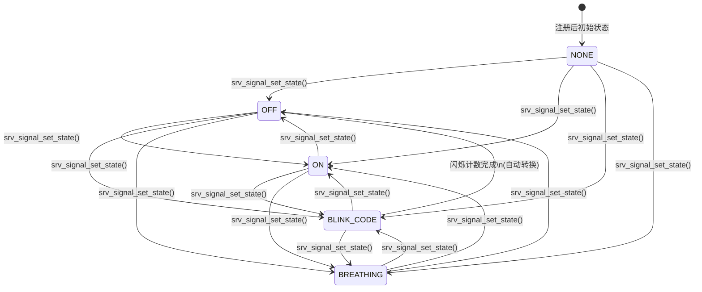

# 信号/输出控制模块 (srv_signal)

<p align='right'>版本: 2.1.0 | 作者: max </p>

支持 ON/OFF、编码闪烁、呼吸四种工作状态的通用信号/输出控制模块（适用于 LED、蜂鸣器等 PWM 输出设备）。采用 **FSM 状态机** 管理状态转换，**msg_fifo 异步命令队列** 接收外部指令，**clist 侵入式链表** 管理实例。

---

## 核心特性

- **异步命令架构** — 内置 `msg_fifo` 命令队列，状态切换和参数修改均为异步执行，不阻塞调用者。
- **FSM 状态管理** — ON/OFF/BLINK_CODE/BREATHING，支持进入/退出回调。
- **硬件解耦** — 输出操作通过 `write_output(uint16_t)` 回调注入，模块不直接依赖 HAL。
- **闪烁参数热更新** — 闪烁过程中可动态修改频率/次数，开状态延迟到关后生效，避免毛刺。
- **呼吸** — 基于正弦 + Gamma 校正的平滑呼吸曲线，支持动态调整周期/幅度范围。
- **静态分配** — 所有内存由调用者提供，无动态分配依赖。

---

## 配置结构体

### `srv_signal_config_t` — 基础配置

| 字段               | 类型                        | 说明                                  |
| :----------------- | :-------------------------- | :------------------------------------ |
| `name`             | `const char*`               | 实例唯一名称，用于查找                |
| `init_state`       | `srv_signal_state_t`               | 注册后的初始状态                      |
| `write_output`        | `void (*)(uint16_t value)`  | 输出写入：0=关, 1023=最大, 中间=呼吸 |
| `breath_cycle_ms`  | `uint16_t`                  | 呼吸周期(ms)，0=2000                  |
| `breath_step_ms`   | `uint16_t`                  | 步进间隔(ms)，0=30                    |
| `breath_min_duty`  | `uint16_t`                  | 呼吸最小输出(0-1023)，0=0             |
| `breath_max_duty`  | `uint16_t`                  | 呼吸最大输出(0-1023)，0=1023          |

写入回调用户自行实现，负责 PWM 输出或 GPIO 写（0 和 1023 对应关和最大）。

### `srv_signal_cmd_t` — 异步命令

| 字段                    | 类型          | 说明                            |
| :---------------------- | :------------ | :------------------------------ |
| `set_state`         | `srv_signal_state_t` | 目标状态                        |
| `blink_cycle_ms`    | `uint16_t`    | 闪烁间隔 (ms)                   |
| `blink_wait_ms`     | `uint16_t`    | 等待间隔 (ms)                   |
| `blink_code_counts` | `uint16_t`    | 闪烁次数（`0`=无限循环）        |
| `breath_cycle_ms`   | `uint16_t`    | 呼吸周期(ms)，0=不变            |
| `breath_min_duty`   | `uint16_t`    | 呼吸最小值，`0xFFFF`=不变       |
| `breath_max_duty`   | `uint16_t`    | 呼吸最大值，`0xFFFF`=不变       |

---

## 使用指南

### 1. 初始化系统

```c
#include "srv_signal.h"

// 注入系统毫秒计数函数
srv_signal_init(HAL_GetTick);
```

### 2. 实现输出回调

```c
// PWM 模式（推荐）
static void led_write_output(uint16_t value) {
    // value 0-1023，设置 PWM 占空比或 GPIO
    pwm_set_duty(value);
}
```

### 3. 注册实例

```c
static srv_signal_handle_t s_led;

const srv_signal_config_t cfg = {
    .name = "sig0",
    .init_state = SRV_SIGNAL_STATE_OFF,
    .write_output = led_write_output,
    .breath_cycle_ms = 2000,   // 2s 呼吸周期
    .breath_min_duty = 0,
    .breath_max_duty = 1023,
};
srv_signal_register_static(&cfg, &s_led);
```

### 4. 注册回调

```c
void on_state_change(srv_signal_handle_t* h, srv_signal_state_t s, void* ud) { ... }
void on_blink_phase(srv_signal_handle_t* h, srv_signal_blink_phase_t p, void* ud) { ... }
void on_edge(srv_signal_handle_t* h, bool rising, void* ud) { ... }

srv_signal_set_callbacks(led, on_state_change, on_blink_phase, on_edge, NULL);
```

### 5. 控制输出

```c
srv_signal_set_state(led, SRV_SIGNAL_STATE_ON);              // 常开 (write_output(1023))
srv_signal_set_state(led, SRV_SIGNAL_STATE_OFF);             // 关闭 (write_output(0))
srv_signal_set_state(led, SRV_SIGNAL_STATE_BLINK_CODE);      // 编码闪烁
srv_signal_set_state(led, SRV_SIGNAL_STATE_BREATHING);       // 呼吸
```

**配置闪烁参数（异步命令）:**

```c
srv_signal_set_blink_interval(led, &(srv_signal_cmd_t){
    .blink_cycle_ms = 100,
    .blink_wait_ms = 1000,
    .blink_code_counts = 3,
});
srv_signal_set_state(led, SRV_SIGNAL_STATE_BLINK_CODE);
```

**配置呼吸参数（异步命令）:**

```c
srv_signal_set_state(led, &(srv_signal_cmd_t){
    .set_state = SRV_SIGNAL_STATE_BREATHING,
    .breath_cycle_ms = 3000,
    .breath_min_duty = 100,
    .breath_max_duty = 900,
});
```

### 6. 任务刷新

```c
// 需在主循环或定时器中定期调用（建议周期 ≤ 10ms）
srv_signal_task_refresh();
```

---

## 编码闪烁行为

闪烁由两个阶段构成循环：

- **BLINKING** — 按 `blink_cycle_ms` 间隔翻转（1023/0），每个下降沿计数一次
- **INTERVAL** — 保持关闭 `blink_wait_ms`，结束后继续下一轮

| `blink_code_counts` | 行为 |
| :---------------------- | :--------------------------------------- |
| `0`                     | 无限循环，不会自动关闭 |
| `> 0`                   | 闪烁指定次数后自动切换到 `SRV_SIGNAL_STATE_OFF` |

---

## 呼吸行为

呼吸通过正弦波 + Gamma 校正实现平滑的自然呼吸效果：

```
phase = breath_cycle × 2π / total_steps
brightness = (sin(phase) + 1) × 0.5
gamma = powerf(brightness, 2.2)
output = min_duty + gamma × (max_duty - min_duty)
```

- 从其他状态切换到 BREATHING 时，自动从**当前输出值**反算初始相位，无跳变
- 可通过异步命令动态修改周期、幅度范围，实时生效

---

## 状态列表

| 状态                     | 说明       |
| :----------------------- | :--------- |
| `SRV_SIGNAL_STATE_NONE`         | 空闲       |
| `SRV_SIGNAL_STATE_OFF`          | 关闭       |
| `SRV_SIGNAL_STATE_ON`           | 常开       |
| `SRV_SIGNAL_STATE_BLINK_CODE`   | 编码闪烁   |
| `SRV_SIGNAL_STATE_BREATHING`    | 呼吸       |

### 状态转换图



> - 实线箭头：外部通过 `srv_signal_set_state()` 触发的主动切换
> - 虚线箭头：FSM 内部自动转换（BLINK_CODE 计数完成后切 OFF，其他状态无自动转换）
> - 所有状态均可互相转换，FSM 未限制任何转移路径

---

## API 参考

| 函数                             | 说明                                    |
| :------------------------------- | :-------------------------------------- |
| `srv_signal_init(cb)`                   | 初始化信号输出子系统，注入时间回调      |
| `srv_signal_deinit()`                   | 反初始化，释放所有资源                  |
| `srv_signal_register_static(cfg, h)`    | 静态注册实例，使用预分配内存            |
| `srv_signal_unregister(name)`           | 注销指定名称的实例                      |
| `srv_signal_get_instance(name)`         | 根据名称获取实例句柄                    |
| `srv_signal_get_head()`                 | 获取实例链表头                          |
| `srv_signal_set_state(h, state)`        | 异步设置实例运行状态                    |
| `srv_signal_set_blink_interval(h, cmd)` | 异步配置闪烁参数                        |
| `srv_signal_get_blink_phase(h)`         | 获取当前闪烁阶段                        |
| `srv_signal_set_callbacks(...)`         | 注册状态/闪烁阶段/边沿回调              |
| `srv_signal_task_refresh()`             | **核心任务**，驱动所有实例 FSM 状态步进 |

---

## 注意事项

1. **刷新频率**: `srv_signal_task_refresh()` 的调用频率决定了闪烁/呼吸的精度，建议周期 ≤ 10ms。
2. **输出初始化**: `srv_signal_register_static` 前需要调用者自行完成 GPIO/PWM 初始化。
3. **队列容量**: 命令队列约可缓存 9 条命令，超过容量时旧命令不会被覆盖、新命令静默丢弃。
4. **write_output 范围**: 值域 0-1023。0=关，1023=最大，中间值用于呼吸 PWM。
5. **呼吸平滑过渡**: 从 ON（1023）或 OFF（0）切换到 BREATHING 时，从当前输出值开始连续呼吸，无突变。
