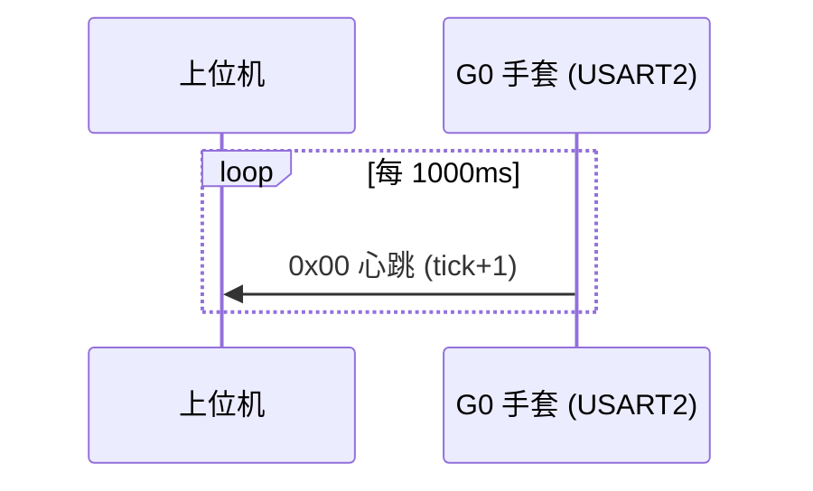
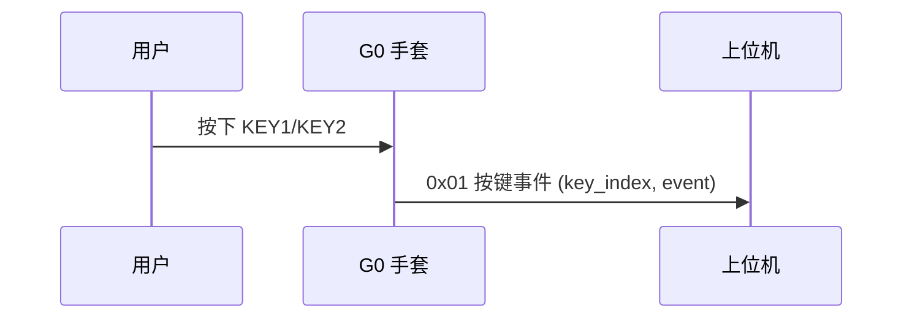
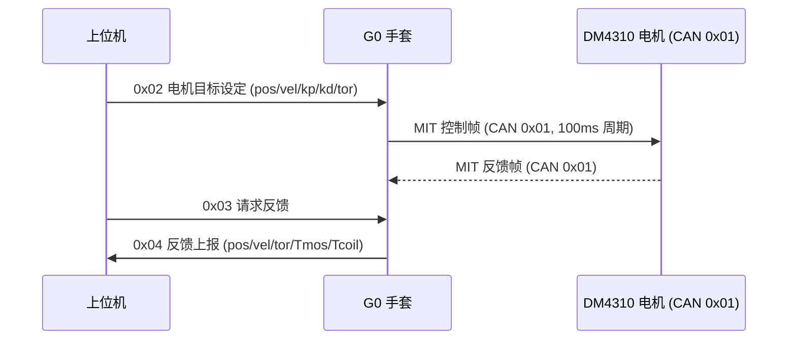

# G0_Hand 串口通信协议规范

> 适用工程：`G0_hand_ctrl_sample`（STM32F103C8Tx）
> 链路：USART2（PA2 TX / PA3 RX），波特率 `115200`，8 数据位 / 无校验 / 1 停止位
> 实现：`applications/app_uart_interact.c` + `service/srv_uart_tx_cmd.c` / `srv_uart_rx_cmd.c`

---

## 1. 系统架构

一句话概述：G0 手套经 USART2 与上位机交互，周期上报心跳与按键事件，并接收电机目标设定/反馈查询命令；所有帧统一使用 `z-cmd-len-payload-crc-\n` 变长帧封装。

通用设计原则表：

| 原则 | 说明 |
|------|------|
| 变长帧 | 载荷长度由 `data_len` 字段决定（`uint8_t`，最大 `255` 字节） |
| 收发自洽 | 发送端 `protocol_packer` 与接收端 `protocol_parser` 使用同一帧结构 |
| 校验 | 每帧携带 1 字节 CRC8，覆盖帧头至载荷 |
| 全双工 | TX 与 RX 独立 DMA 通道，互不阻塞 |

---

## 2. 布局/寻址空间

### 2.1 命令字（CMD）寻址空间

| CMD 值 | 方向 | 名称 | 载荷长度 |
|--------|:---:|------|---------|
| `0x00` | G0 → 上位机 | 心跳上报 | `2` |
| `0x01` | G0 → 上位机 | 按键事件上报 | `2` |
| `0x02` | 上位机 → G0 | 电机目标设定 | `20` |
| `0x03` | 上位机 → G0 | 请求电机反馈 | `0` |
| `0x04` | G0 → 上位机 | 电机反馈上报 | `20` |

### 2.2 核心结构体字段表

| 字段 | 类型 | 长度 | 说明 |
|------|------|------|------|
| `cmd` | `uint8_t` | `1` | 命令字，见 2.1 |
| `data_len` | `uint8_t` | `1` | 载荷字节数（`0`~`255`） |
| `payload` | `uint8_t[]` | `data_len` | 命令数据载荷 |
| `crc` | `uint8_t` | `1` | CRC8 校验字节 |
| `heartbeat_tick` | `uint16_t` | `2` | 心跳计数（小端） |
| `key_index` | `uint8_t` | `1` | 按键索引：`0`=KEY1，`1`=KEY2 |
| `event` | `uint8_t` | `1` | 按键事件，见 `key_base.h` |

---

## 3. 通信链路层

### 3.1 逻辑通道

| 通道 | 物理 | 波特率 | 用途 |
|------|------|--------|------|
| UART 命令通道 | USART2 | `115200` | 心跳/按键/电机控制与反馈 |

### 3.2 通用帧格式（所有 CMD 共用）

| Byte 0 | Byte 1 | Byte 2 | Byte 3 ... 3+len-1 | Byte 3+len | Byte 4+len |
|--------|--------|--------|--------------------|------------|------------|
| `0x7A`（'z' 帧头） | `cmd` | `data_len` | `payload` | `crc` | `0x0A`（'\n' 帧尾） |

字段说明表：

| 字段 | 偏移 | 长度 | 说明 |
|------|------|------|------|
| 帧头 | Byte 0 | `1` | 固定 `0x7A`（ASCII 'z'） |
| `cmd` | Byte 1 | `1` | 命令字，`uint8_t` |
| `data_len` | Byte 2 | `1` | 载荷长度，`uint8_t`，取值 `0`~`255` |
| `payload` | Byte 3 | `data_len` | 命令载荷 |
| `crc` | Byte 3+len | `1` | CRC8（多项式 `0x31`，初值 `0xFF`，覆盖 Byte0~payload） |
| 帧尾 | Byte 4+len | `1` | 固定 `0x0A`（ASCII '\n'） |

帧总长 = `data_len + 5`。载荷最大 `255` → 帧最大 `260` 字节。

---

## 4. 协议帧定义

### 4.1 `0x00` 心跳上报（G0 → 上位机）

| Byte 0 | Byte 1 | Byte 2 | Byte 3 | Byte 4 | Byte 5 | Byte 6 |
|--------|--------|--------|--------|--------|--------|--------|
| `0x7A` | `0x00` | `0x02` | tick LSB | tick MSB | `crc` | `0x0A` |

字段说明表：

| 字段 | 偏移 | 长度 | 说明 |
|------|------|------|------|
| `cmd` | Byte 1 | `1` | 固定 `0x00` |
| `data_len` | Byte 2 | `1` | 固定 `0x02` |
| `heartbeat_tick` | Byte 3~4 | `2` | `uint16_t` 小端，每帧 `+1` |

### 4.2 `0x01` 按键事件上报（G0 → 上位机）

| Byte 0 | Byte 1 | Byte 2 | Byte 3 | Byte 4 | Byte 5 | Byte 6 |
|--------|--------|--------|--------|--------|--------|--------|
| `0x7A` | `0x01` | `0x02` | `key_index` | `event` | `crc` | `0x0A` |

字段说明表：

| 字段 | 偏移 | 长度 | 说明 |
|------|------|------|------|
| `cmd` | Byte 1 | `1` | 固定 `0x01` |
| `data_len` | Byte 2 | `1` | 固定 `0x02` |
| `key_index` | Byte 3 | `1` | `uint8_t`：`0`=KEY1，`1`=KEY2 |
| `event` | Byte 4 | `1` | `uint8_t`，`key_base_event_t` 枚举值，见下表 |

`event` 字段取值表：

**上报事件（仅以下两个会产生串口帧）**

| 值 | 枚举成员 | 事件 | 触发说明 |
|:---:|---------|------|---------|
| `0x00` | `KEY_BASE_EVENT_PRESS` | 按下事件 | 引脚按下沿触发（按下瞬间） |
| `0x01` | `KEY_BASE_EVENT_RELEASE` | 松开事件 | 引脚松开沿触发（松开瞬间） |

**上报策略**：`app_uart_interact.c` 的按键回调仅放行 `PRESS`/`RELEASE` 两个边沿事件，其余事件（单击/双击/长按等）由本地消抖状态机消化，不产生串口帧；其中 `PRESS` 同时联动电机位置微调（KEY1 `+0.1` rad、KEY2 `-0.1` rad）。

**时间参数**（`service/srv_key.c` 配置，`key_base.c` 实际生效）：

| 参数 | 配置值 | 实际生效值 | 说明 |
|------|--------|-----------|------|
| 长按阈值 `long_press_time_ms` | `1000` ms | `1000` ms（下限 `500` ms） | 按住超过该时长触发 `LONG_WAIT_PRESS` / `LONG_HOLD` |
| 连击窗口 `multi_click_time_ms` | `300` ms | `300` ms | 松开后该窗口内的 `DOWN` 次数决定单击/双击/三连击/重复点击 |
| 冷却窗口 `cooling_window` | — | `500` ms（长按阈值/2） | 长按松开后 `500` ms 内忽略再次按下，防误触 |

**连击判定逻辑（内部事件）**：每次短按（`DOWN`）计数，松开后在 `300` ms 窗口内无新按下则按累计次数判定：`1`→单击 `0x05`、`2`→双击 `0x06`、`3`→三连击 `0x07`、`≥4`→重复点击 `0x08`；上述事件不产生串口帧。

### 4.3 `0x02` 电机目标设定（上位机 → G0）

| Byte 0 | Byte 1 | Byte 2 | Byte 3~6 | Byte 7~10 | Byte 11~14 | Byte 15~18 | Byte 19~22 | Byte 23 | Byte 24 |
|--------|--------|--------|---------|-----------|------------|------------|------------|---------|---------|
| `0x7A` | `0x02` | `0x14` | `pos` | `vel` | `kp` | `kd` | `tor` | `crc` | `0x0A` |

字段说明表：

| 字段 | 偏移 | 长度 | 说明 |
|------|------|------|------|
| `cmd` | Byte 1 | `1` | 固定 `0x02` |
| `data_len` | Byte 2 | `1` | 固定 `0x14`（`20`） |
| `pos` | Byte 3~6 | `4` | `float` 小端，量程 `[-12.5, 12.5]` rad |
| `vel` | Byte 7~10 | `4` | `float` 小端，量程 `[-30, 30]` rad/s |
| `kp` | Byte 11~14 | `4` | `float` 小端，量程 `[0, 500]` |
| `kd` | Byte 15~18 | `4` | `float` 小端，量程 `[0, 5]` |
| `tor` | Byte 19~22 | `4` | `float` 小端，限幅 `[-0.1, 0.1]` N·m |

### 4.4 `0x03` 请求电机反馈（上位机 → G0）

| Byte 0 | Byte 1 | Byte 2 | Byte 3 | Byte 4 |
|--------|--------|--------|--------|--------|
| `0x7A` | `0x03` | `0x00` | `crc` | `0x0A` |

字段说明表：

| 字段 | 偏移 | 长度 | 说明 |
|------|------|------|------|
| `cmd` | Byte 1 | `1` | 固定 `0x03` |
| `data_len` | Byte 2 | `1` | 固定 `0x00`（无载荷） |

收到后 G0 立即回发 `0x04` 反馈帧。

### 4.5 `0x04` 电机反馈上报（G0 → 上位机）

| Byte 0 | Byte 1 | Byte 2 | Byte 3~6 | Byte 7~10 | Byte 11~14 | Byte 15~18 | Byte 19~22 | Byte 23 | Byte 24 |
|--------|--------|--------|---------|-----------|------------|------------|------------|---------|---------|
| `0x7A` | `0x04` | `0x14` | `pos` | `vel` | `tor` | `Tmos` | `Tcoil` | `crc` | `0x0A` |

字段说明表：

| 字段 | 偏移 | 长度 | 说明 |
|------|------|------|------|
| `cmd` | Byte 1 | `1` | 固定 `0x04` |
| `data_len` | Byte 2 | `1` | 固定 `0x14`（`20`） |
| `pos` | Byte 3~6 | `4` | `float` 小端，实测位置 rad |
| `vel` | Byte 7~10 | `4` | `float` 小端，实测速度 rad/s |
| `tor` | Byte 11~14 | `4` | `float` 小端，实测扭矩 N·m |
| `Tmos` | Byte 15~18 | `4` | `float` 小端，MOS 温度 ℃ |
| `Tcoil` | Byte 19~22 | `4` | `float` 小端，线圈温度 ℃ |

---

## 5. 升级/业务流交互

### 5.1 心跳链路验证

### 5.2 按键上报

### 5.3 电机目标设定与反馈查询

---

## 6. 超时与错误处理

### 6.1 协议级超时与恢复

| 参数/错误码 | 数值/值 | 触发条件 | 行为与恢复策略 |
|------------|---------|----------|----------------|
| RX 空闲超时 | `protocol_parser` 内部 | 帧不完整且长时间无新字节 | 丢弃缓存头字节，重新同步帧头 `0x7A` |
| 帧头不匹配 | `PROTOCOL_PARSER_ERROR_HEADER_MISMATCH` | 首字节非 `0x7A` | 逐字节滑动直到匹配帧头 |
| CRC 校验失败 | `PROTOCOL_PARSER_ERROR_CHECKSUM` | `crc` 与本地计算不符 | 丢弃本帧，从下一字节重新解析 |
| 帧尾不匹配 | `PROTOCOL_PARSER_ERROR_FOOTER_MISMATCH` | 末字节非 `0x0A` | 丢弃本帧，重新同步 |
| UART RX 错误 | `HAL_UART_ErrorCallback` | ORE/FE/NE 等 | 丢弃缓冲重启 RX，`drv_uart_recover` 兜底 |
| TX 队列满 | `SRV_UART_TX_CMD_ERROR_TX_BUSY` | 发送队列溢出 | 该帧丢弃，调用方记录 WARN |

### 6.2 电机层时序与在线监控

| 参数/错误码 | 数值/值 | 触发条件 | 行为与恢复策略 |
|------------|---------|----------|----------------|
| 初始化→使能延时 | `1500` ms | 进入 INIT 状态后 | 等待电机/总线稳定再发使能帧 |
| 使能→控制帧延时 | `250` ms | 使能帧上总线后 | 延时后开始 100ms 周期控制帧 |
| 控制帧周期 | `100` ms | ENABLED 状态 | 周期发送 MIT 控制帧维持闭环 |
| 电机离线检测 | `500` ms | 未收到 CAN 反馈 | 触发离线回调打印掉线事件 |

### 6.3 状态转移矩阵（电机 FSM）

| 从 → 到 | UNINIT | INIT | ENABLED | DISABLED |
|---------|:---:|:---:|:---:|:---:|
| **UNINIT** | — | `s_init_request` | | |
| **INIT** | | — | 延时 ≥1500ms 且 `s_enable_request` | |
| **ENABLED** | | | — | `s_disable_request` |
| **DISABLED** | | | `s_enable_request` | — |

---

## 7. 启动/初始化决策

| 条件 | 动作 |
|------|------|
| 上电 | 初始状态 UNINIT，安全侧（24V 关断） |
| 应用初始化 | `daemon_init` → `srv_uart_tx/rx_cmd_init` → 注册按键回调 |
| 电机服务初始化 | 状态 → INIT，配置 MIT 默认参数（kp=`2.5`，kd=`0.5`） |
| 等待 `1500` ms | 状态 → ENABLED，发使能帧 `FF FF FF FF FF FF FF FC`（CAN `0x01`） |
| 使能帧上总线后 `250` ms | 开始 `100` ms 周期 MIT 控制帧 |
| 电机在线 | 每收到 CAN 反馈喂狗（超时 `500` ms 判离线） |

---

## 附录

### 传输时序图例（表格表示）

| 序号 | 方向 | 帧内容 | 说明 |
|:---:|:---:|--------|------|
| 1 | G0 → Host | `0x7A 0x00 0x02 <tick_lo> <tick_hi> <crc> 0x0A` | 心跳，每 `1000` ms |
| 2 | G0 → Host | `0x7A 0x01 0x02 <key_index> <event> <crc> 0x0A` | 按键事件 |
| 3 | Host → G0 | `0x7A 0x02 0x14 <pos> <vel> <kp> <kd> <tor> <crc> 0x0A` | 电机目标 |
| 4 | Host → G0 | `0x7A 0x03 0x00 <crc> 0x0A` | 请求反馈 |
| 5 | G0 → Host | `0x7A 0x04 0x14 <pos> <vel> <tor> <Tmos> <Tcoil> <crc> 0x0A` | 反馈上报 |

### 关键宏与常量表

| 宏/常量 | 值 | 说明 |
|---------|-----|------|
| `APP_UART_CMD_HEARTBEAT` | `0x00` | 心跳命令 |
| `APP_UART_CMD_KEY_EVENT` | `0x01` | 按键事件命令 |
| `APP_UART_CMD_MOTOR_SET_TARGET` | `0x02` | 电机目标命令 |
| `APP_UART_CMD_MOTOR_REQ_FEEDBACK` | `0x03` | 请求反馈命令 |
| `APP_UART_CMD_MOTOR_FEEDBACK_REPORT` | `0x04` | 反馈上报命令 |
| `SRV_UART_TX_CMD_MAX_PAYLOAD` | `255` | 最大载荷长度 |
| `SRV_UART_TX_CMD_MAX_FRAME` | `260` | 最大帧长 |
| `SRV_DM4310_POS_STEP_RAD` | `0.1f` | 按键位置微调步长 |
| `SRV_DM4310_TORQUE_LIMIT_NM` | `0.1f` | 扭矩限幅 |
| `SRV_DM4310_DAEMON_TIMEOUT_MS` | `500` | 电机离线超时 |
| `SRV_DM4310_CTRL_SEND_PERIOD_MS` | `100` | 控制帧周期 |
