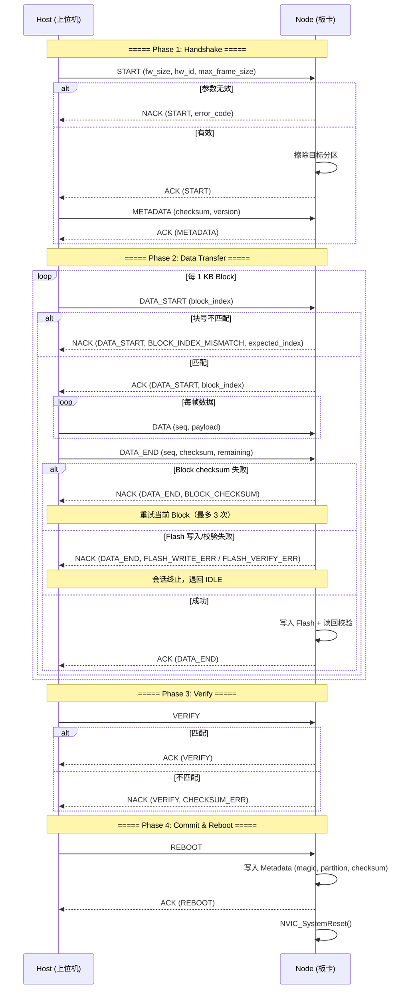

# STM32G474 Bootloader 通信协议规范

| 项目 | 信息 |
|------|------|
| **文档版本** | V1.4.0 |
| **目标 MCU** | STM32G474RBTx (Cortex-M4, 128 KB Flash) |
| **传输层** | CAN 2.0B / CAN FD (ISO 11898-1:2015) |
| **帧格式** | 标准 11-bit ID，DATA 帧 |

---

## 1. 系统架构

本 Bootloader 基于 **双 A/B 分区 + ring_storage KV 元数据** 架构，通过 CAN / CAN FD 总线实现固件安全升级。任何升级中断（包括异常断电）不会导致系统"变砖"。

### 1.1 核心设计原则

| 原则 | 说明 |
|------|------|
| **双分区冗余** | 始终保留一个可启动的 App 分区。新固件写入备用分区，验证通过后切换引导。 |
| **双重校验闭环** | Block 级 16-bit 累加和（传输安全）+ 整包 32-bit 累加和（存储安全）+ Flash 读回比对。 |
| **断点续传** | Block 粒度的重传机制。校验失败仅重传当前 1 KB Block，最多重试 3 次。 |
| **CAN FD 自适应** | 兼容经典 CAN (8 B) 和 CAN FD (最高 64 B)，帧长在 START 握手阶段协商。 |
| **Checksum 固定偏移** | `DATA_END` 的 16-bit 校验码固定在 `Byte 2-3`，避免 CAN FD 离散 DLC 尾部填充干扰。 |
| **块对齐显式握手** | 每个 1 KB Block 传输前以 `DATA_START` 帧声明块号，板端校验后回带确认索引。 |

---

## 2. Flash 分区布局

### 2.1 分区地址映射

| 区域 | 起始地址 | 大小 | 说明 |
|------|----------|------|------|
| Bootloader | `0x08000000` | 64 KB | 只读，不参与升级。负责校验并引导 App。 |
| App A | `0x08010000` | 24 KB | 主运行分区（`BOOT_PARTITION_A`）。 |
| App B | `0x08016000` | 24 KB | 备用分区（`BOOT_PARTITION_B`）。新固件写入此分区。 |
| Metadata | `0x0801C000` | 16 KB | 由 `ring_storage` KV 管理，存储 `boot_metadata_t`。 |

分区大小由宏定义：

```c
#define BOOT_FLASH_BOOT_SIZE    0x10000U  // 64 KB
#define BOOT_FLASH_APP_SIZE     0x6000U   // 24 KB
#define BOOT_FLASH_META_SIZE    0x4000U   // 16 KB
```

### 2.2 Metadata 结构体

| 偏移 | 字段 | 类型 | 说明 |
|------|------|------|------|
| `0` | `magic` | `uint32_t` | 魔数 `0x424F4F54` ("BOOT") |
| `4` | `boot_partition` | `uint8_t` | 引导分区：`0` = A，`1` = B |
| `5` | `upgrade_flag` | `uint8_t` | `0` = 正常，`1` = 升级中，`2` = 待验证 |
| `6` | `version` | `uint16_t` | 固件版本号 |
| `8` | `fw_size` | `uint32_t` | 固件大小（字节） |
| `12` | `fw_checksum` | `uint32_t` | 整包 32-bit 累加和 |
| `16` | `reboot_counts` | `uint32_t` | MCU 上电启动次数 |
| `20` | `reserved` | `uint32_t` | 预留 |

---

## 3. 通信链路层

### 3.1 CAN 标识符分配

| 方向 | CAN ID | 说明 |
|------|--------|------|
| 上位机 → 板卡 | `0x701` | 命令帧（Host → Node） |
| 板卡 → 上位机 | `0x702` | 应答帧（Node → Host） |

> **注**：Host ID 可在上位机 GUI 配置，Node ID = Host ID + 1。

### 3.2 帧长协商与离散集合

帧物理长度在 `START` 握手阶段从以下离散集合中选择：

```
{ 8, 12, 16, 20, 24, 32, 48, 64 }  单位：字节
```

- `8` = 经典 CAN，其余 = CAN FD
- 协商结果在整个升级会话中生效
- 数据载荷 = `max_frame_size - 2`（扣除 `Command` + `Sequence` 头开销）

### 3.3 通用帧格式

所有 CAN 数据帧遵循以下格式：

| Byte 0 | Byte 1 | Byte 2 ... N |
|--------|--------|--------------|
| `Command` | `Sequence` | Payload |

| 字段 | 偏移 | 长度 | 说明 |
|------|------|------|------|
| `cmd` | Byte 0 | `1` | 命令字（`uint8_t`） |
| `seq` | Byte 1 | `1` | 帧序号（`uint8_t`，仅 `DATA` 帧递增，其余置 `0`） |
| `payload` | Byte 2 | `max_frame_size - 2` | 数据载荷 |

---

## 4. 协议帧定义

### 4.1 命令字一览

| 命令 | 值 | 方向 | 说明 |
|------|-----|------|------|
| `BOOT_CMD_START` | `0x01` | H → N | 开始升级，协商帧长与硬件兼容 ID |
| `BOOT_CMD_METADATA` | `0x02` | H → N | 固件元数据（校验和 + 版本） |
| `BOOT_CMD_DATA` | `0x03` | H → N | 固件数据帧 |
| `BOOT_CMD_VERIFY` | `0x04` | H → N | 触发整包校验 |
| `BOOT_CMD_REBOOT` | `0x05` | H → N | 确认升级 + 写入 Metadata + 复位 |
| `BOOT_CMD_CANCEL` | `0x06` | H → N | 取消升级，安全退回 IDLE |
| `BOOT_CMD_DATA_START` | `0x07` | H → N | 1 KB Block 传输启动（携带块号） |
| `BOOT_CMD_DATA_END` | `0x08` | H → N | 1 KB Block 尾帧（携带 16-bit 校验和） |
| `BOOT_CMD_ACK` | `0x10` | N → H | 肯定应答 |
| `BOOT_CMD_NACK` | `0x11` | N → H | 否定应答（携带状态码） |

### 4.2 START 帧

**用途**：启动升级会话，协商帧长并验证硬件兼容性。

| Byte 0 | Byte 1 | Byte 2 | Byte 3 | Byte 4 | Byte 5 | Byte 6 | Byte 7 |
|--------|--------|--------|--------|--------|--------|--------|--------|
| `0x01` | `0x00` | `fw_size` (MSB) | | | (LSB) | `hw_id` (MSB) | (LSB) |

| 字段 | 偏移 | 长度 | 说明 |
|------|------|------|------|
| `cmd` | Byte 0 | `1` | `0x01` |
| `seq` | Byte 1 | `1` | 固定 `0x00` |
| `fw_size` | Byte 2-5 | `4` | 固件总大小（`uint32_t`，大端序） |
| `hw_id` | Byte 6-7 | `2` | 硬件兼容 ID（`uint16_t`，大端序）；板端校验，不匹配则拒绝 |
| `max_frame_size` | Byte 8 | `1` | 协商帧物理长度（`uint8_t`，取值 `{8,12,16,20,24,32,48,64}`） |

> `START` 帧固定 9 字节，仅在 CAN FD 64 字节模式下可承载。

### 4.3 METADATA 帧

**用途**：传输整包 32-bit 累加和校验码与固件版本号。

| Byte 0 | Byte 1 | Byte 2 | Byte 3 | Byte 4 | Byte 5 | Byte 6 |
|--------|--------|--------|--------|--------|--------|--------|
| `0x02` | `0x00` | `checksum` (MSB) | | | (LSB) | `version` (MSB) |

| 字段 | 偏移 | 长度 | 说明 |
|------|------|------|------|
| `cmd` | Byte 0 | `1` | `0x02` |
| `seq` | Byte 1 | `1` | 固定 `0x00` |
| `checksum` | Byte 2-5 | `4` | 整包 32-bit 累加和（`uint32_t`，大端序，`sum(data) & 0xFFFFFFFF`） |
| `version` | Byte 6-7 | `2` | 固件版本号（`uint16_t`，大端序） |

> 最小 DLC = 7。上位机发送时补齐到协商帧长。

### 4.4 DATA_START 帧

**用途**：声明即将传输的 1 KB Block 索引号。

| Byte 0 | Byte 1 | Byte 2 | Byte 3 |
|--------|--------|--------|--------|
| `0x07` | `0x00` | `block_index` (MSB) | (LSB) |

| 字段 | 偏移 | 长度 | 说明 |
|------|------|------|------|
| `cmd` | Byte 0 | `1` | `0x07` |
| `seq` | Byte 1 | `1` | 固定 `0x00` |
| `block_index` | Byte 2-3 | `2` | 块号（`uint16_t`，大端序），从 `0` 开始递增 |

> 最小 DLC = 4。板端校验块号与期望值一致，不一致时 NACK 回带期望块号。

### 4.5 DATA 帧

**用途**：传输固件数据载荷。每个 1 KB Block 内序号递增。

| Byte 0 | Byte 1 | Byte 2 ... N |
|--------|--------|--------------|
| `0x03` | `seq` | `payload[0..N-3]` |

| 字段 | 偏移 | 长度 | 说明 |
|------|------|------|------|
| `cmd` | Byte 0 | `1` | `0x03` |
| `seq` | Byte 1 | `1` | 帧序号（`uint8_t`），从 `0` 开始，每个 Block 内递增 |
| `payload` | Byte 2 | `max_frame_size - 2` | 固件数据分片 |

### 4.6 DATA_END 帧

**用途**：标记 1 KB Block 传输结束，携带 16-bit 累加和校验码及尾部数据。

| Byte 0 | Byte 1 | Byte 2 | Byte 3 | Byte 4 ... N |
|--------|--------|--------|--------|--------------|
| `0x08` | `seq` | `checksum` (MSB) | (LSB) | `remaining_data[0..N-4]` |

| 字段 | 偏移 | 长度 | 说明 |
|------|------|------|------|
| `cmd` | Byte 0 | `1` | `0x08` |
| `seq` | Byte 1 | `1` | 该 Block 最后一帧序号 |
| `checksum` | Byte 2-3 | `2` | 16-bit 累加和（`uint16_t`，大端序，`sum(block_data) & 0xFFFF`） |
| `remaining_data` | Byte 4 | `DLC - 4` | Block 尾部剩余数据（< 1 KB） |

> **CAN FD DLC 填充注意**：CAN FD 数据长度离散。当 `DATA_END` 帧未填满离散长度时，上位机以 `0x00` 填充。板端解析时以缓冲区剩余空间截断 `rem_len`（`min(rem_len, FREE_SPACE)`），而非直接信任 DLC。

### 4.7 VERIFY 帧

| Byte 0 | Byte 1 |
|--------|--------|
| `0x04` | `0x00` |

| 字段 | 偏移 | 长度 | 说明 |
|------|------|------|------|
| `cmd` | Byte 0 | `1` | `0x04` |
| `seq` | Byte 1 | `1` | 固定 `0x00` |

### 4.8 REBOOT 帧

| Byte 0 | Byte 1 |
|--------|--------|
| `0x05` | `0x00` |

板端收到后写入 `Metadata`（目标分区、版本、校验和），发送 `ACK`，然后执行 `NVIC_SystemReset()`。

### 4.9 CANCEL 帧

| Byte 0 | Byte 1 |
|--------|--------|
| `0x06` | `0x00` |

板端在任何状态下收到 `CANCEL` 都安全退回 `IDLE`。备用分区未提交（可能部分写入），不影响主分区启动。

### 4.10 ACK 帧

| Byte 0 | Byte 1 | Byte 2 | Byte 3-4（可选） | Byte 5-7 |
|--------|--------|--------|-----------------|----------|
| `0x10` | `cmd` | `status` | `block_index` | 填充 `0x00` |

| 字段 | 偏移 | 长度 | 说明 |
|------|------|------|------|
| `cmd` | Byte 1 | `1` | 应答的命令字 |
| `status` | Byte 2 | `1` | `0x00` = `STATUS_OK` |
| `block_index` | Byte 3-4 | `2` | 仅 `DATA_START` 应答携带（`uint16_t`，大端序），其余帧填充 `0x0000` |

### 4.11 NACK 帧

| Byte 0 | Byte 1 | Byte 2 | Byte 3-4（可选） | Byte 5-7 |
|--------|--------|--------|-----------------|----------|
| `0x11` | `cmd` | `error_code` | `expected_block_index` | 填充 `0x00` |

| 字段 | 偏移 | 长度 | 说明 |
|------|------|------|------|
| `cmd` | Byte 1 | `1` | 否定应答的命令字 |
| `error_code` | Byte 2 | `1` | 错误码（见 §6.3） |
| `expected_block_index` | Byte 3-4 | `2` | 仅 `BLOCK_INDEX_MISMATCH` 时携带（`uint16_t`，大端序） |

---

## 5. 升级流程交互

### 5.1 正常升级时序（4 阶段）



### 5.2 断点续传设计

每个 1 KB Block 的传输是原子操作：

| 机制 | 说明 |
|------|------|
| **Block 级重试** | `DATA_END` 校验失败 → NACK → Host 重发同一 `DATA_START` + 数据，最多 3 次 |
| **块号校验** | `DATA_START` 携带 `block_index`，板端校验与 `expected_block_index` 一致 |
| **序号校验** | Block 内 `DATA` 帧序号从 `0` 递增，错序时 NACK 回带期望块号 |
| **块级看门狗** | 当前 Block 帧间隔 > `100 ms` 时 NACK，Host 重发 `DATA_START` |
| **CANCEL 安全** | 任何时刻收到 `CANCEL` 退回 `IDLE`，主分区不受影响 |

### 5.3 状态转移矩阵

| 从 → 到 | **IDLE** | **START** | **DATA_TRANSFER** | **VERIFY_PENDING** | **REBOOT_PENDING** |
|---------|:---:|:---:|:---:|:---:|:---:|
| **IDLE** | — | 收到有效 `START` | | | |
| **START** | 收到 `CANCEL` / 超时 | 重复 `START`（重新协商） | 收到 `METADATA` | | |
| **DATA_TRANSFER** | 收到 `CANCEL` / 超时 / Flash 致命错误 | | — | 全部数据接收完毕 | |
| **VERIFY_PENDING** | 校验失败 / 超时 | | | 重复 `VERIFY` | 校验通过 |
| **REBOOT_PENDING** | 超时 | | | | 收到 `REBOOT` |

---

## 6. 超时与错误处理

### 6.1 超时参数

| 参数 | 数值 | 触发条件 | 行为与恢复策略 |
|------|------|----------|----------------|
| 全局会话超时 | `6000 ms` | 任意非 `IDLE` 状态下无任何帧活动超过此值 | 复位到 `IDLE`，等待新 `START` |
| Block 帧间隔超时 | `100 ms` | `DATA_TRANSFER` 中 Block 活跃期内帧间隔超限 | NACK + 复位 Block 局部状态，Host 重发 `DATA_START` |

### 6.2 ACK/NACK 状态码

| 值 | 名称 | 触发条件 | 恢复策略 |
|----|------|----------|----------|
| `0x00` | `STATUS_OK` | 操作成功 | — |
| `0x01` | `STATUS_BLOCK_CHECKSUM` | Block 16-bit 累加和不匹配 | Host 重试当前 1 KB Block |
| `0x02` | `STATUS_FLASH_WRITE_ERR` | Flash 写入硬件失败 | 终止会话，退回 `IDLE` |
| `0x03` | `STATUS_FLASH_VERIFY_ERR` | Flash 读回逐字节比对不一致 | 终止会话，退回 `IDLE` |
| `0x04` | `STATUS_CHECKSUM_ERR` | 整包 32-bit 累加和不匹配 | 终止会话，退回 `IDLE` |
| `0x05` | `STATUS_INVALID_FRAME` | 帧格式无效或 DLC 不足 | 丢弃 |
| `0x06` | `STATUS_INVALID_STATE` | 当前状态不允许此命令 | 丢弃 |
| `0x07` | `STATUS_TIMEOUT` | Block 帧间隔超时 | Host 重发 `DATA_START` |
| `0x08` | `STATUS_HW_MISMATCH` | 硬件兼容 ID 不匹配 | 终止会话 |
| `0x09` | `STATUS_FLASH_ERASE_ERR` | 分区擦除失败 | 终止会话 |
| `0x0A` | `STATUS_FLASH_READ_ERR` | Flash 读取失败（校验阶段） | 终止会话 |
| `0x0B` | `STATUS_FRAME_SIZE` | 帧长度不在离散集合中 | 拒绝 `START`，Host 自行调整后重试 |
| `0x0C` | `STATUS_FW_TOO_BIG` | 固件大小超过分区容量 | 拒绝 `START`，Host 自行调整 |
| `0x0D` | `STATUS_BLOCK_INDEX_MISMATCH` | 块号不一致，回带期望块号 | Host 重发正确的 `DATA_START` |

### 6.3 错误恢复与重试策略

| 错误场景 | 重试次数 | 回退策略 |
|----------|---------|----------|
| Block 累加和失败 | ≤ 3 次 | 重试当前 Block，超过 3 次建议终止 |
| Block 帧间隔超时 | ∞ | Host 重发 `DATA_START`（会话内恢复） |
| 硬件 ID 不匹配 | 0 | Host 自行检查固件版本 |
| Flash 写入/读回失败 | 0 | 硬件异常，终止会话 |
| 全局会话超时 | 0 | 复位到 IDLE，Host 从 `START` 重新开始 |

---

## 7. 启动引导决策

### 7.1 启动条件分支

| 步骤 | 条件 | 结果 |
|------|------|------|
| 1 | `meta.magic != 0x424F4F54` | 无有效 Metadata → 进入 Bootloader |
| 2 | `meta.upgrade_flag != 0` | 升级未完成 → 进入 Bootloader |
| 3 | `boot_flash_compute_checksum() != meta.fw_checksum` | 校验和不匹配 → 进入 Bootloader |
| 4 | 全部通过 | 跳转到 App 分区执行 |

### 7.2 A/B 分区切换逻辑

- 读取 Metadata 确定当前活动分区
- 新固件写入 **相反** 分区
- 旧分区在新固件验证通过前**不被擦除**
- 验证 + 提交后，Metadata 更新为新的目标分区
- 下次启动从新分区引导

---

## 附录

### A.1 传输时序图例

| 步骤 | 方向 | 帧类型 | 负载概要 | 说明 |
|------|------|--------|----------|------|
| 1 | H → N | `START` | `fw_size` + `hw_id` + `max_frame_size` | 协商会话参数 |
| 2 | N → H | `ACK` / `NACK` | `status` | 确认参数有效/无效 |
| 3 | H → N | `METADATA` | `checksum` + `version` | 传输校验码和版本 |
| 4 | N → H | `ACK` / `NACK` | `status` | 确认 Metadata 有效 |
| 5-7 | H ↔ N | `DATA_START` / `ACK` / `DATA` × N / `DATA_END` / `ACK` | 逐 Block | 循环传输所有 Block |
| 8 | H → N | `VERIFY` | 无 | 触发整包校验 |
| 9 | N → H | `ACK` / `NACK` | `status` + `checksum` | 返回校验结果 |
| 10 | H → N | `REBOOT` | 无 | 确认升级完成 |
| 11 | N → H | `ACK` | `status` | 最后应答 |
| 12 | N → N | — | — | `NVIC_SystemReset()` |

### A.2 关键宏与常量

| 宏/常量 | 值 | 说明 |
|---------|-----|------|
| `BOOT_CAN_ID_HOST_TO_NODE` | `0x701` | 上位机 CAN ID |
| `BOOT_CAN_ID_NODE_TO_HOST` | `0x702` | 板卡 CAN ID |
| `BOOT_FRAME_HEADER_LEN` | `2` | 帧头长度（`cmd` + `seq`） |
| `BOOT_BLOCK_SIZE` | `1024` | 数据块大小（1 KB） |
| `BOOT_FSM_TIMEOUT_MS` | `6000` | 全局会话超时（ms） |
| `BOOT_BLOCK_TIMEOUT_MS` | `100` | Block 帧间隔超时（ms） |
| `BOOT_FLASH_BOOT_SIZE` | `0x10000` (64 KB) | Bootloader 分区大小 |
| `BOOT_FLASH_APP_SIZE` | `0x6000` (24 KB) | App 分区大小 |
| `BOOT_FLASH_META_SIZE` | `0x4000` (16 KB) | Metadata 分区大小 |
| `BOOT_METADATA_MAGIC` | `0x424F4F54` | Metadata 魔数 "BOOT" |

### A.3 校验算法参考

**16-bit Block 累加和**（`boot_transport_compute_block_checksum`）：

```python
def compute_block_checksum(data: bytes) -> int:
    return sum(data) & 0xFFFF
```

**32-bit 整包累加和**（`boot_flash_compute_checksum` ↔ `compute_checksum32`）：

```python
def compute_checksum32(data: bytes) -> int:
    return sum(data) & 0xFFFFFFFF
```
